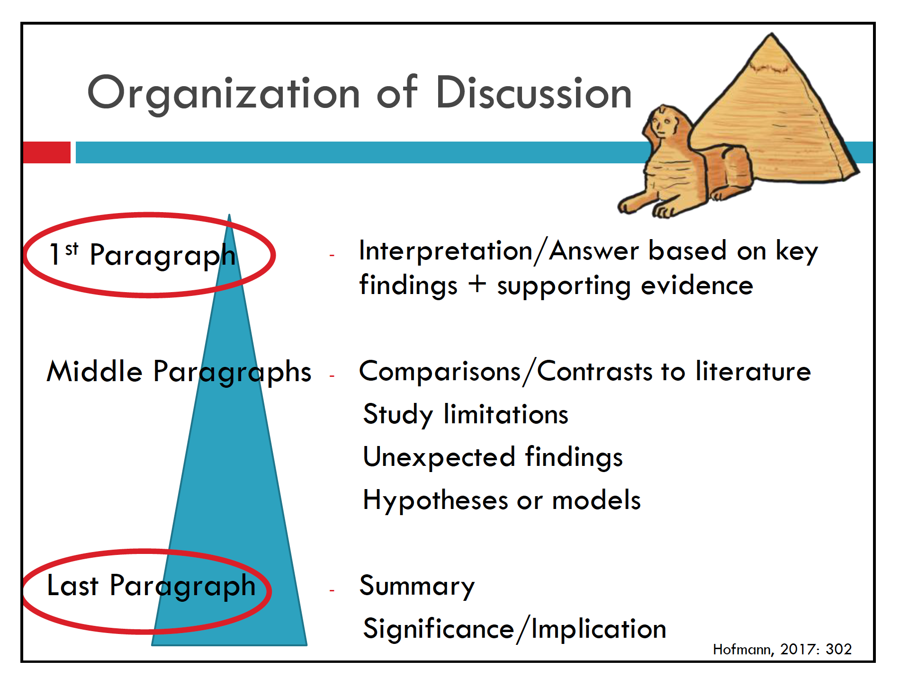

The main function of the Discussion section is to answer the question(s) posed in the Introduction.

The discussion section will also

* explain how the specific results support the answers

* show how the answers relate to what is already known

* suggest future research directions

It is not a recap!
There needs to be added value to the reader.

How should we start?

* Interpret and support key findings: answer the question that you posed in the Introduction and highlight evidence.

* If desired, restate study purpose or provide brief context first (\>2 sentences).

## Organization of Discussion

<!-- **1st Paragraph** -->

<!-- * Interpretation/Answer based on key findings -->

<!-- * supporting evidence -->

<!-- **Middle Paragraphs** -->

<!-- * Comparisons/Contrasts to literature -->

<!-- * Study limitations -->

<!-- * Unexpected findings -->

<!-- * Hypotheses or models -->

<!-- **Last Paragraph** -->

<!-- * Summary -->

<!-- * Significance/Implication -->

## Content ("Information elements")

1. Review of the purpose of the study
    - activity, research questions, hypotheses

2. Review of findings (from most to least significant)
    - Compared to your expectations
    - Compared to others' findings

3. Explanations and/or speculations on findings

4. Limitations of the study

5. Implications of your research (generalisations)

6. Recommendations for future research & applications of your research

### Two main Components

1. State and interpret your key findings (Answer your research question)
    - Interpret key findings & conclude based on **your findings** and **the literature**
    - Explain how you reached the conclusions: compare/contrast with the literature
    - Give the paper significance by **generalizing** the results
    - Indicate clearly how you have advanced knowledge

2. Summarize and generalize (What is new and why your results are important)
    - Include explanations any results that don't support your answers
    - Discuss other results and relevant hypotheses
    - Discuss possible errors/limitations
    - Provide explanations of unexpected findings
    - Suggest next steps

## Drafting your Paper

What are your **research questions**/hypotheses? (How will you word them in your **introduction**?)

What are your **answers**? (How will you word them in your **Discussion**?)

1. Type **the aim (questions)** of your paper?
    - We hypothesized that...
    - We tested the hypothesis that...
    - We asked whether...
    - To answer this question...
    - This prompted us to investigate whether...
    - To resolve this apparent difference...
    - We solved this problem by...
    - The purpose of our study was...

2. Type **the answer** to "this question" (the aim of your paper)

3. Type **the result** that support the answer

4. Type **the explanation** of how the result support the answer

Look at your "question" and your "answer", how well do they align?

Have you used the same **key terms**? the same point of view (**grammatical subject**)? the same **verb**?

You should answer your question exactly.

### 1st Paragraph

Linking Introduction & Discussion, answering the question exactly:

* Question: Does sympathetic stimulation increase norepinephrine synthesis in rat superior cervical ganglia in vivo?

* Answer: This study shows that sympathetic stimulation *increases* norepinephrine synthesis in rat superior cervical ganglia in vivo

* Answer: This study shows that sympathetic stimulation *does not increase* norepinephrine synthesis in rat superior cervical ganglia in vivo

### Middle Paragraphs

Discuss other important findings

* Most to least important

* What they mean & strengthen of your belief

Comparing/contrasting your findings with others

* Write a list of *similar findings*
    - This finding is consistent with that of Smith (2000) who...
    - In accordance with the present results, previous studies have demonstrated that...
    - These results support previous research into this brain area which links X and Y.

* Write a list of *contrasting findings*
    - In contrast to earlier findings, however, no evidence of X was detected.
    - This study has been unable to demonstrate that...
    - This discrepancy could be attributed to...
    - There are two likely causes for the differences between...

* Now try to the write out your findings in sentences
    - For sentence starters refer to [Academic Phrasebank](http://www.phrasebank.manchester.ac.uk/)
    - Explain conflicting results, if you can
    - Give pro and con arguments for your conclusion(s)

Summarize and generalize where possible.
Don't discuss every single result

### Last Paragraph

Provide closure: write a one paragraph conclusion that summarizes your interpretations

* Interpretation of key results (the answer)

* Significance of the work
    - Try to generalise to broader situations
    - Practical application
    - Theoretical proposition

* Ensure your wording matches your level of certainty

In conclusion (**end clearly signalled**), this study shows that desert frogs can avoid death by desiccation (**interpretation of results**) by maintaining a high body water content and water storage in their urinary bladder and by rapid hydration when water is available (**key findings**). 
These measure may be employed in combination with behavioural adaptations such as burrowing and change in pigmentation to minimize stresses tending to dehydrate the animals (**generalisation**).

## Language features

Need to pay attention to verb choice

* Attitude to findings

* Strength of claim

A very common structure in Discussions: **main clause** (with projecting verb) + **that clause** (with another verb)

* These results *prove* the test material *is* more rigid.

* Our results *demonstrate* X *regulates* Y.

* It *appears* X *has* Y.

* The presence of X *suggests* Y *may be stabilised* by Z.*

Which verb is making the stronger claim?

* The results indicate/*establish* that there is a link...

* Table 9 suggests/*shows* a greater response when...

* The latest data question/*challenge* the conclusions of...

* The results *validate*/support the hypothesis that...

* The test results *create*/suggest a basis for...

* Changes in X may have influenced/*distorted* the...

* Figure 12 depicts/*clarifies* the relationship between...

**Main** + **That** clause sentences, 2 opportunities to indicate the strength of your claim

* Main verb (choice of verb, tense of verb)

* Verb in that clause (tense, use of modal or not)

Important to match strength of sentences with the strength of the data / arguments

Tense of Verb in the **that clause**

* Simple past tense: applies to your study only
    - It is possible that microbial activity caused some immobilization of labial soil phosphorous.

* Simple present tense: general condition
    - It is possible that microbial activity causes some immobilization of labial soil phosphorous.

* It is also possible to substitute the that clause with a Noun Phrase
    - Don't need to decide what tense to use in the that clause
    - Previous studies have demonstrated that there is a positive relationship between propagule pressure and the establishment success of non native species.

Softening claims, express probability by using

* modal auxiliary verbs (may, can, could)

* adjectives (possible, likely, uncertain)

* nouns (possibility, suggestion)

Distance yourself from the claim by

* using impersonal constructions
    - seems/appears to/that...
    - it has been said that...
    - it is believed...

* attributing the belief to others
    - in the view of some experts...
    - many researchers hold that...

Weaken generalisations by:

* using the verb "tend"

* qualifying the subject (most, many, a majority of, certain types of, nearly all)

* mentioning the evidence
    - According to this preliminary study
    - Based on the limited data available

* adding exceptions
    - With the exception of...
    - Apart from
    - Except for...

* Use a weaker verb e.g.:
    - leads -\> contributes
    - causes -\> is associated with
    - proves -\> suggests

Academic writers often use more than one of these strategies when making claims, e.g.

* This result seems to suggest that...

* Based on the data, there is reason to believe that...

But don't overdo it!
Excessive qualification leads to saying nothing.

## Common problems (how to check)

The answer/interpretation of key findings is not provided in the first paragraph

No concluding paragraph is provided

The importance/ significance of the study is not clear

Results are repeated or summarised in the discussion section

Often too long and verbose or too short and underdeveloped.

## Other considerations

Give credit where it is deserved

* Methods/results from other studies added important elements to your study design

* your work supports/improves upon work of others

Be transparent about unexpected/results that disagree with others

* Explain the differences, don't pretend they don't exist

Acknowledge limitations/alternative explanations of your findings

* Preempt a reviewer's opportunity to point them out

## Final Discussion Check

Remember that you need to ensure that your **Discussion** connects clearly with the issues you raised in your **Introduction**

* the country where you began

* your research niche

* your statement of purpose or main activity.

When the first draft of the Discussion is ready, go back to the Introduction and check for a close fit.
If necessary, redraft the Introduction to make sure the issues of importance in the Discussion appear there also.