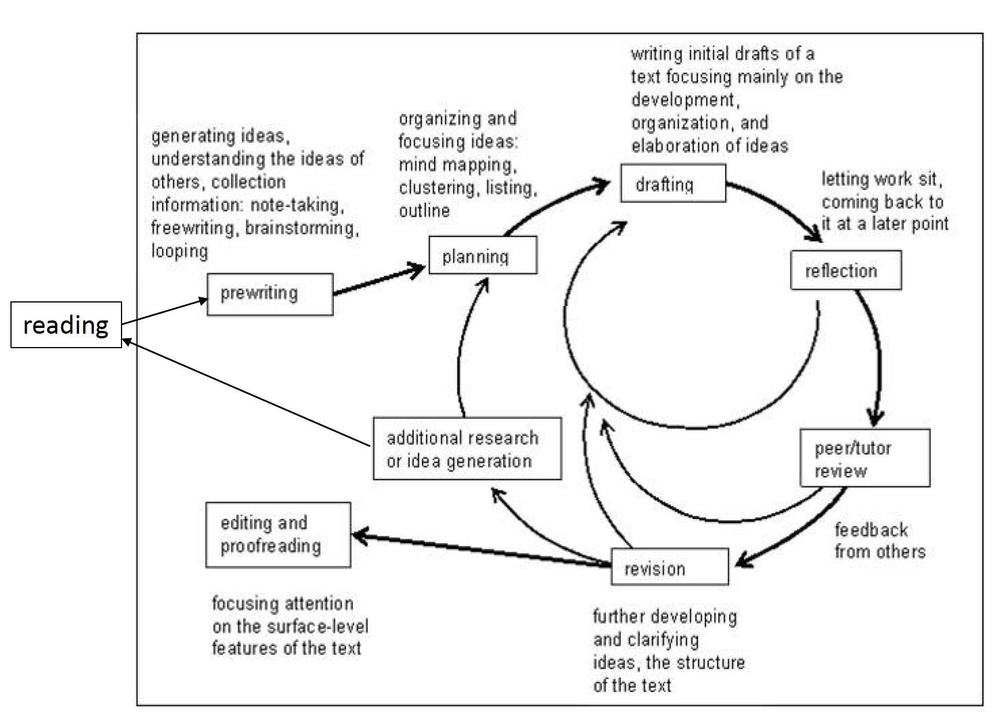
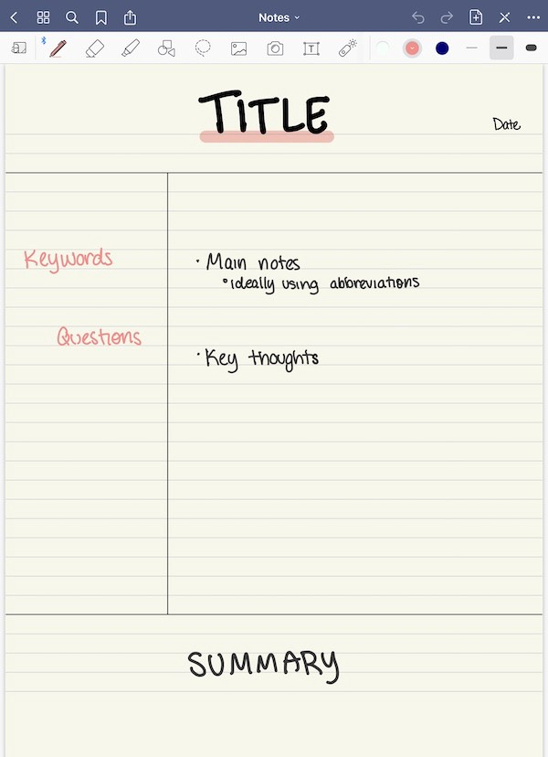

Scientific writing is storytelling.

1. What did you do?

2. Why did you do it?

3. How did you do it?

4. What did you find?

5. What does it mean?

Scientific writing is engaged rhetoric: not just tell but persuade!

General Rule for Academic Writing: K.I.S.S

* Keep it Short and Simple

* Keep it Simple, Stupid

> Make every word count
>
> Clarity
>
> Readability
>
> Non-Ambiguity


## Writing starts with reading

Writing is a process

```{r echo=FALSE}

```

Ideas come from reading. Your writing starts with your reading

* Establish good reading practice early

* Read as if you are already an academic
    - Don't take everything as "fact"
    - Read as if it is a discussion/dialogue with the authors
    - Your writing will be judged as you are academic

* Read with purpose

* Take purposeful notes
    - [**Cornell Note Taking**](https://medium.goodnotes.com/study-with-ease-the-best-way-to-take-notes-2749a3e8297b)
        - chose the quotes or paraphrases or details you expect to include in your thesis
        - put key words, identify themes, or recurrent patterns
        - write sentences that summarise the page
    - Take note and care of what verbs you use to describe the literature
    - The verb you use to describe someone else’s work indicates your feeling about the quality of the work


```{r echo=FALSE}

```


Reading: Look beyond the content

* What language devices and techniques are used to structure and present their ideas?

* How do they use references to make their own stances and positions clear?

* How are arguments signposted, supported, and developed across texts?

* How do authors introduce the theoretical backgrounds from which they are drawing?

* How do they handle the literature?

* What formal features are they using to scaffold their ideas and academic voices?


## Academic Style (Formal Writing)

* Single verbs

* Formal negative forms

* Indirect questions

* Middle adverb placement

* Do not use contractions (don’t, wouldn’t, it’s)

* Avoid run on expressions (and so on, etc)


### Verb Choice

Phrasal Verb (verb + particle) 

Prepositional Verb (verb + preposition)

**Single Verb**

* When these concepts are *implemented* they produce an immediate health care benefit.

* According to some biologists, *offering* clear proof of the decreasing numbers of frogs has been difficult.

* Researchers *examined* the way strain *intensifies* round a geological fault.


### Personal Pronouns

"We" increasingly common in publications

* We investigated the sound repertoire and sound characteristics of the longsnout seahorse.

* We tested the effects of prey protein and lipid content on the body composition and subsequent diet regulation of the web building spider.

Avoid addressing reader as "you" -\> need to use passive voice

* The results can be seen in Table 1.


### Negative Forms

not...any -\> no

* The analysis yielded *no* new results.

not...much -\> little

* Mood had *little* effect on judgements.

not...many -\> few

* This problem has *few* viable solutions.

Don’t use too many negative terms in the same sentence

* Two negatives = a positive


### Direct Questions

Direct questions draw attention to a point

* Why has antibiotic resistance increased?

In academic writing, indirect questions more common

* It is unknown as to why antibiotic resistance has increased.  

* However, it is unclear why antibiotic resistance has increased.


### adverb placement

Mid-position (before the verb)

* This method was *originally* developed by Charles et al.

* The morphology of the samples was *then* analysed using a scanning electron microscope.


### Contractions (don't, wouldn't, it's)


### Run on (e.g. and so on, etc.)


